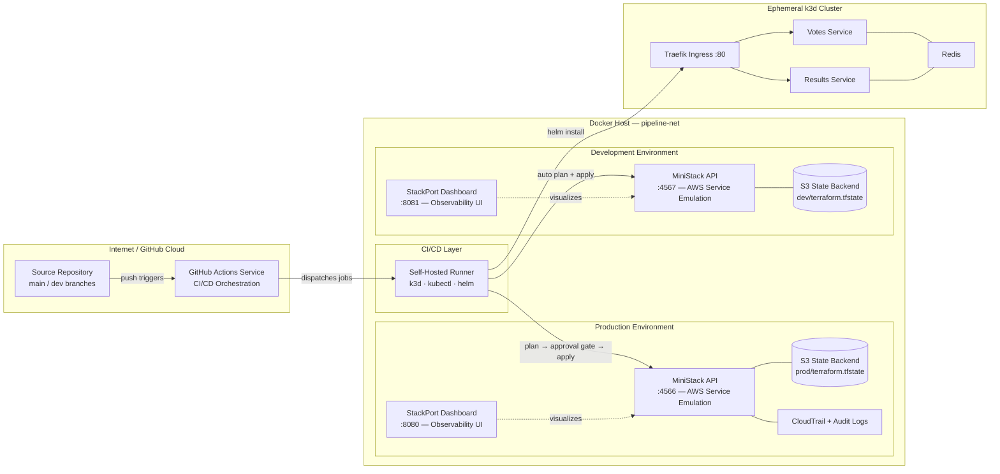

# pipeline-lab

A fully containerized local DevSecOps pipeline — a GitHub Actions self-hosted runner triggering Terraform plan/apply against MiniStack (AWS-compatible emulator), with no host pollution and a Makefile as the sole operator interface.

## Prerequisites

- **Docker** (running and accessible without `sudo`)
- **GitHub repo** named `pipeline-lab`
- **GitHub PAT** (fine-grained, repo-scoped, with Administration: Read and Write) — used to auto-generate runner registration tokens; no manual token management required

## Quickstart

```bash
# 1. Copy the env template and fill in real values
cp .env.template .env
# Edit .env — set GITHUB_PAT and GITHUB_OWNER

# 2. Start all containers
make up

# 3. Bootstrap tfstate buckets in both MiniStack instances
make bootstrap

# 4. Push to dev branch to deploy to dev MiniStack
git checkout -b dev
git push -u origin dev
```

## Makefile Targets

| Target | Description |
|--------|-------------|
| `make up` | Start all containers (prod + dev MiniStack, runner, UIs) |
| `make down` | Stop containers, preserve state |
| `make bootstrap` | Create tfstate buckets in both MiniStack instances |
| `make destroy` | Deregister runner, remove containers + volumes + state |
| `make status` | Show running container status |
| `make logs` | Tail all container logs |
| `make ui` | Open prod MiniStack dashboard (localhost:8080) |
| `make ui-dev` | Open dev MiniStack dashboard (localhost:8081) |
| `make k8s-up` | Create k3d cluster, wait for readiness |
| `make k8s-down` | Delete k3d cluster |
| `make k8s-status` | Show cluster nodes and pods |
| `make k8s-cli` | Interactive shell with kubectl access |
| `make images-build` | Build votes and results container images |
| `make images-import` | Import built images into k3d cluster |

## Architecture



- **`dev` branch** → auto plan + apply against `ministack-dev:4566`, then create k3d cluster, deploy vote-app, run integration tests, destroy cluster
- **`main` branch** → plan, then manual approval gate, then apply against `ministack:4566` (prod), then same k3d lifecycle
- **StackPort** dashboards provide a web UI to inspect MiniStack resources (S3 buckets, DynamoDB tables, IAM roles, etc.)

State is isolated: dev state in `dev/terraform.tfstate`, prod state in `prod/terraform.tfstate`, both stored in the `pipeline-lab-tfstate` S3 bucket within their respective MiniStack instance.

MiniStack emulates S3, DynamoDB, IAM, STS, KMS, CloudTrail, EC2, CloudWatch Logs, Secrets Manager, and more.

## Infrastructure Controls

Terraform resources map to FedRAMP-adjacent control families:

| Control Family | Resources | Coverage |
|----------------|-----------|----------|
| **AC-2, AC-6** Access Control | IAM role, permission boundary policy, inline policy, S3 public access block | Least-privilege role with scoped trust policy and documented max permissions |
| **AU-2, AU-3** Audit | CloudTrail trail with log file validation | API call auditing with integrity verification |
| **AU-3, AU-9** Audit Storage | S3 audit bucket with versioning and public access block | Tamper-resistant log storage, no anonymous access |
| **SC-7** Boundary Protection | VPC, private subnets, security group (TLS-only), S3 + DynamoDB VPC endpoints | No public subnets, all traffic within VPC boundary |
| **SC-12, SC-13** Cryptographic Protection | KMS key with automatic rotation | Encryption at rest with key rotation enabled |

## GitHub Actions Workflows

- [terraform-plan.yml](.github/workflows/terraform-plan.yml) — prod (main branch, approval gate)
- [terraform-dev.yml](.github/workflows/terraform-dev.yml) — dev (dev branch, auto-apply)

## Kubernetes (k3d)

The pipeline creates an ephemeral k3d cluster per workflow run. Terraform provisions persistent AWS infrastructure via MiniStack; Helm deploys the vote-app microservices onto the ephemeral cluster. The cluster is destroyed after each run.

| Component | Purpose | Lifecycle |
|-----------|---------|-----------|
| k3d cluster | Kubernetes runtime | Created/destroyed per pipeline run |
| Helm chart | vote-app deployment | Ephemeral — installed at run start |
| Redis | State store for vote counts | emptyDir volume, reset on pod restart |
| Traefik Ingress | L7 routing to services | Bundled with k3d |

### Vote-app Routes

| Route | Service | Method |
|-------|---------|--------|
| `/vote` | votes:8080 | POST |
| `/results` | results:8081 | GET |

## Notes

- The self-hosted runner auto-generates registration tokens from `GITHUB_PAT` — no manual token refresh required
- Runner image includes Node.js 24 (required for `actions/checkout@v6` and `hashicorp/setup-terraform@v4`)
- Terraform provider credentials are hardcoded test values (safe for local dev only; use Vault or env vars for real environments)