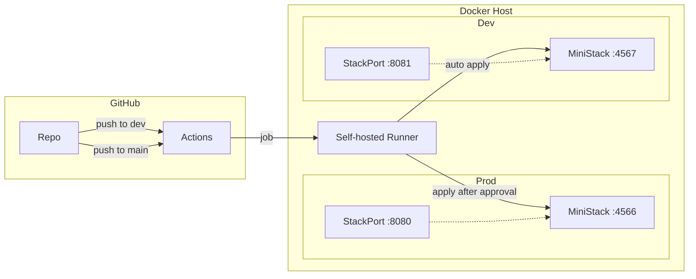

# pipeline-lab

A fully containerized local DevSecOps pipeline — a GitHub Actions self-hosted runner triggering Terraform plan/apply against MiniStack (AWS-compatible emulator), with no host pollution and a Makefile as the sole operator interface.

## Prerequisites

- **Docker** (running and accessible without `sudo`)
- **GitHub repo** named `pipeline-lab`
- **GitHub Runner Registration Token** (from repo Settings → Actions → Runners → New self-hosted runner)
- **GitHub PAT** (fine-grained, repo-scoped, with Administration: Read and Write for runner deregistration)

## Quickstart

```bash
# 1. Copy the env template and fill in real values
cp .env.template .env
# Edit .env — set GITHUB_RUNNER_TOKEN, GITHUB_PAT, GITHUB_OWNER

# 2. Start all containers
make up

# 3. Bootstrap tfstate buckets in both MiniStack instances
make bootstrap

# 4. Push to dev branch to deploy to dev MiniStack
git checkout -b dev
git push -u origin dev
```

## Makefile Targets

| Target | Description |
|--------|-------------|
| `make up` | Start all containers (prod + dev MiniStack, runner, UIs) |
| `make down` | Stop containers, preserve state |
| `make bootstrap` | Create tfstate buckets in both MiniStack instances |
| `make destroy` | Deregister runner, remove containers + volumes + state |
| `make status` | Show running container status |
| `make logs` | Tail all container logs |
| `make ui` | Open prod MiniStack dashboard (localhost:8080) |
| `make ui-dev` | Open dev MiniStack dashboard (localhost:8081) |

## Architecture



- **`dev` branch** → auto plan + apply against `ministack-dev:4566`
- **`main` branch** → plan, then manual approval gate, then apply against `ministack:4566` (prod)

State is isolated: dev state in `dev/terraform.tfstate`, prod state in `prod/terraform.tfstate`, both stored in the `pipeline-lab-tfstate` S3 bucket within their respective MiniStack instance.

MiniStack emulates S3, DynamoDB, IAM, STS, KMS, CloudTrail, EC2, CloudWatch Logs, Secrets Manager, and more.

## Phase I Scope

- Credentials are hardcoded in Terraform provider config (test keys only, safe for local dev)
- Terraform resources: VPC, private subnets, security group, S3 + DynamoDB VPC endpoints, KMS key, IAM role with permission boundary, S3 audit bucket with versioning + public access block, CloudTrail trail
- Vault integration for secrets management is planned for Phase II

## GitHub Actions Workflows

- [terraform-plan.yml](.github/workflows/terraform-plan.yml) — prod (main branch, approval gate)
- [terraform-dev.yml](.github/workflows/terraform-dev.yml) — dev (dev branch, auto-apply)