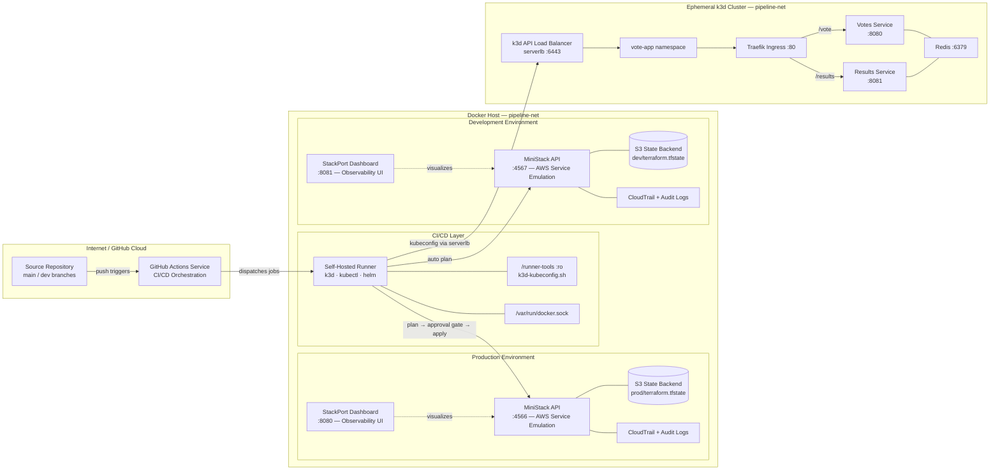

# pipeline-lab

A fully containerized local DevSecOps pipeline — a GitHub Actions self-hosted runner triggering Terraform plan/apply against MiniStack (AWS-compatible emulator), with no host pollution and a Makefile as the sole operator interface.

## Prerequisites

- **Docker** (running and accessible without `sudo`)
- **GitHub repo** named `pipeline-lab`
- **GitHub PAT** (fine-grained, repo-scoped, with Administration: Read and Write) — used to auto-generate runner registration tokens; no manual token management required

## Quickstart

```bash
# 1. Copy the env template and fill in real values
cp .env.template .env
# Edit .env — set GITHUB_PAT and GITHUB_OWNER

# 2. Start all containers
make up

# 3. Bootstrap tfstate buckets in both MiniStack instances
make bootstrap

# 4. Push to dev branch to trigger the dev pipeline
git checkout -b dev
git push -u origin dev
```

## Makefile Targets

| Target | Description |
|--------|-------------|
| `make help` | Show all available targets |
| `make up` | Start all containers (prod + dev MiniStack, runner, UIs) |
| `make down` | Stop containers, preserve state |
| `make bootstrap` | Create tfstate buckets in both MiniStack instances |
| `make destroy` | Deregister runner, delete k3d cluster, remove containers + volumes + state |
| `make status` | Show running container status |
| `make logs` | Tail all container logs |
| `make ui` | Open prod MiniStack dashboard (localhost:8080) |
| `make ui-dev` | Open dev MiniStack dashboard (localhost:8081) |
| `make k8s-up` | Create k3d cluster, configure kubeconfig, wait for readiness |
| `make k8s-down` | Delete k3d cluster |
| `make k8s-status` | Show cluster nodes and pods |
| `make k8s-cli` | Interactive shell with kubectl access |
| `make images-build` | Build votes and results container images |
| `make images-import` | Import built images into k3d cluster |

## Architecture



- **`dev` branch** → fmt check, validate, plan (no apply) against `ministack-dev:4567`, then create k3d cluster, build + import images, Helm deploy, wait for readiness, integration test, destroy cluster
- **`main` branch** → fmt check, validate, plan against `ministack:4566`, manual approval gate, apply, then same k3d lifecycle
- **StackPort** dashboards provide a web UI to inspect MiniStack resources (S3 buckets, DynamoDB tables, IAM roles, etc.)

State is isolated: dev state in `dev/terraform.tfstate`, prod state in `prod/terraform.tfstate`, both stored in the `pipeline-lab-tfstate` S3 bucket within their respective MiniStack instance.

MiniStack emulates S3, DynamoDB, IAM, STS, KMS, CloudTrail, EC2, CloudWatch Logs, Secrets Manager, and more.

## Infrastructure Controls

Terraform resources map to FedRAMP-adjacent control families:

| Control Family | Resources | Coverage |
|----------------|-----------|----------|
| **AC-2, AC-6** Access Control | IAM role, permission boundary policy, inline policy, S3 public access block | Least-privilege role with scoped trust policy and documented max permissions |
| **AU-2, AU-3** Audit | CloudTrail trail with log file validation | API call auditing with integrity verification |
| **AU-3, AU-9** Audit Storage | S3 audit bucket with versioning and public access block | Tamper-resistant log storage, no anonymous access |
| **SC-7** Boundary Protection | VPC, private subnets, security group (TLS-only), S3 + DynamoDB VPC endpoints | No public subnets, all traffic within VPC boundary |
| **SC-12, SC-13** Cryptographic Protection | KMS key with automatic rotation | Encryption at rest with key rotation enabled |

## GitHub Actions Workflows

- [terraform-plan.yml](.github/workflows/terraform-plan.yml) — prod (main branch, approval gate before apply)
- [terraform-dev.yml](.github/workflows/terraform-dev.yml) — dev (dev branch, plan only — no apply)

Both workflows follow the same k3d lifecycle after their Terraform steps:

1. Create k3d cluster on the shared Docker network
2. Configure kubeconfig (write to `~/.kube/config`, patch server to k3d load balancer `serverlb:6443`)
3. Build container images
4. Import images into k3d
5. Helm deploy with environment-specific values (prod: 2/2/1 replicas, dev: 1/1/1)
6. Wait for deployments to become available
7. Run integration tests (port-forward + curl)
8. Destroy k3d cluster (always runs, even on failure)

## Kubernetes (k3d)

The pipeline creates an ephemeral k3d cluster per workflow run. All k3d containers (server, agent, load balancer) join the shared `pipeline-net` Docker network, making them reachable by hostname from the runner. The kubeconfig is patched to use `k3d-pipeline-lab-serverlb:6443` (the k3d load balancer) instead of `0.0.0.0` — this keeps TLS valid across server restarts.

| Component | Purpose | Lifecycle |
|-----------|---------|-----------|
| k3d cluster (1 server + 1 agent) | Kubernetes runtime | Created/destroyed per pipeline run |
| k3d load balancer (serverlb) | Stable API endpoint at `:6443` | Bundled with k3d |
| Helm chart | vote-app deployment | Ephemeral — installed at run start |
| Traefik Ingress | L7 routing on `:80` | Bundled with k3d |
| Redis | State store for vote counts | emptyDir volume, reset on pod restart |
| PodDisruptionBudgets | minAvailable: 1 for votes and results | Ephemeral |
| Resource limits | cpu: 50m–200m, memory: 64Mi–128Mi per container | Enforced on all deployments |

### Vote-app Routes

| Route | Service | Method |
|-------|---------|--------|
| `/vote` | votes:8080 | POST |
| `/results` | results:8081 | GET |

## Notes

- The self-hosted runner auto-generates registration tokens from `GITHUB_PAT` — no manual token refresh required
- Runner image includes Node.js 24, k3d, kubectl, and helm
- The runner mounts the host Docker socket (`/var/run/docker.sock`) for image builds and k3d cluster management
- The `runner/` directory is mounted read-only at `/home/runner/runner-tools` for scripts like `k3d-kubeconfig.sh`
- Kubeconfig is written to `~/.kube/config` and patched to use the k3d load balancer hostname — avoids k3d-managed paths that may be cleaned up during cluster state changes
- Terraform provider credentials are hardcoded test values (safe for local dev only; use Vault or env vars for real environments)

## Manual Operations

For a hands-on kubectl runbook covering pod inspection, log tailing, port-forwarding, scaling, Helm operations, and debugging, see [RUNBOOK.md](RUNBOOK.md).